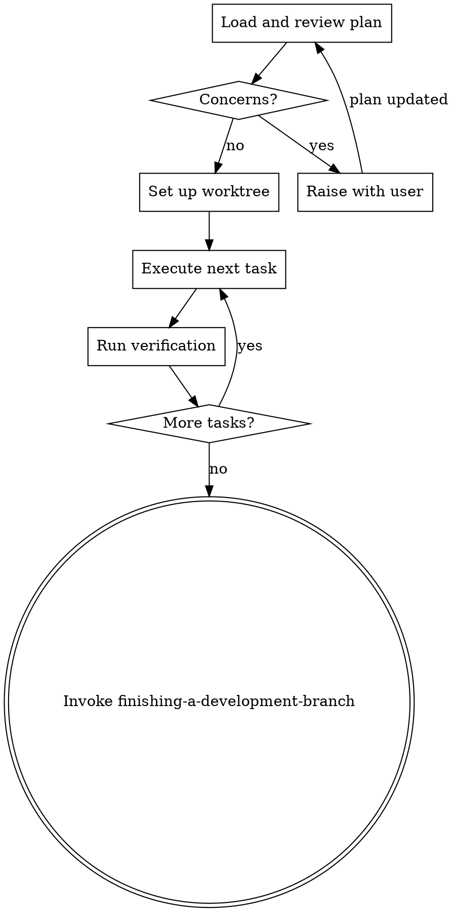

# Executing Plans

Implement an approved plan in controlled batches with explicit verification.

## Required Start

Announce: `I'm using the executing-plans skill to implement this plan.`

## Process

### Step 1: Load and Review Plan
1. Read the plan completely.
2. If `state.md` exists and names this plan, read it first — it records which task is next and what earlier sessions already proved. Resume from there instead of restarting at task 1.
3. Review critically — identify any questions or concerns.
4. If concerns: raise them with the user before starting.
5. If no concerns: create task tracking and proceed.

### Step 2: Set Up Workspace
If working on main/master branch AND the plan involves code changes:
- Set up isolated workspace via `using-git-worktrees`.

If already on a feature branch, or the plan is documentation/config only:
- Skip worktree setup. Confirm with user that the current branch is appropriate.

### Step 3: Execute Tasks
For each task:
1. Follow each step exactly (plan has bite-sized steps with checkboxes).
2. Run verifications as specified.
3. Mark task complete: tick the checkbox in plan.md (`- [ ]` → `- [x]`), then update `state.md`.
4. For tasks involving UI/UX or frontend implementation, apply guidance from `frontend-design`.

**The `state.md` checkpoint is not optional.** This skill exists for execution that spans sessions, so it is the path most likely to be interrupted by a context compaction or a closed terminal. After each completed task, `state.md` must say:

- which plan file is being executed and which task number is next
- what the last verification proved (the command and its result, not "tests pass")
- any fact discovered during execution that the plan does not spell out — exact paths, config keys, function names, non-obvious constraints

Keep it to the diff: update the current task pointer and append newly discovered facts. Do not restate the plan; `plan.md` owns the task list.

Without this, a compaction mid-plan loses the discovered facts and the next session restarts the task from a blank slate — re-deriving what was already proven, or silently redoing completed work.

**Note:** Superpowers works significantly better with subagent support. If subagents are available, use `subagent-driven-development` instead — the quality of work will be higher with fresh-context-per-task and two-stage review gates.

## Engineering Rigor for Complex Tasks

When a task is architectural, high-risk, or touches cross-module boundaries:
- Validate the approach against requirements and constraints before coding.
- Identify edge cases and error paths specific to this task.
- Consider simpler architectures or alternative approaches.
- Ensure changes remain maintainable and don't create hidden coupling.
- If 2 implementation attempts fail, pause and reassess the approach rather than forcing a third attempt.

## Execution Rules

- Do not skip plan steps unless user approves deviation.
- Never start implementation on main/master branch without explicit user consent — ensure isolated workspace is ready first.
- Keep edits scoped to the current task.
- Do not claim completion without fresh command output.

**Stop immediately and ask for clarification — never guess — when:**
- A dependency is missing or unavailable.
- The plan has a critical gap that prevents starting.
- An instruction is unclear or contradictory.
- Verification fails repeatedly (2+ attempts).

## Context Hygiene

For each task, keep only:
- Current task details
- Constraints
- Relevant prior decisions
- Verification evidence

Do not carry long historical summaries. Never forward full session history to subagents — construct their prompts from scratch with only the items above.

## Completion

After all tasks pass verification:
1. Update `state.md` to record that the plan is complete, so the next session does not try to resume it.
2. Announce `finishing-a-development-branch`.
3. Invoke `finishing-a-development-branch`.
